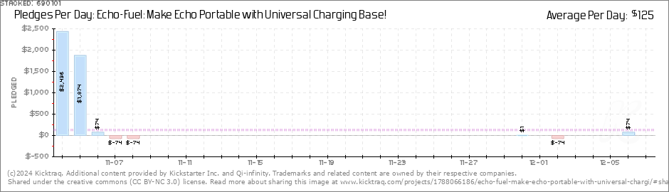

# Number Pledges Per Dag Extractor

This project is designed to extract number pledges per dag from images using Optical Character Recognition (OCR) technology. It's particularly useful for processing images that contain structured numerical data, such as financial reports or data sheets.

## Features

- Splits images into smaller tiles for more accurate OCR processing
- Utilizes EasyOCR for text recognition
- Implements DBSCAN clustering to merge nearby results and eliminate duplicates
- Supports processing of multiple images in a directory
- Outputs results to a CSV file for easy analysis

## Requirements

- Python 3.x
- OpenCV (cv2)
- NumPy
- Pandas
- EasyOCR
- scikit-learn

## Installation

1. Clone this repository:
   ```
   https://github.com/ELSOUDY2030/DailyPledgeExtractor.git
   ```

2. Install the required packages:
   ```
   pip install opencv-python numpy pandas easyocr scikit-learn
   ```

## Usage

Run the script from the command line with the following syntax:

```
python main.py /path/to/image/folder [--rows ROWS] [--cols COLS] [--overlap OVERLAP]
```

Arguments:
- `folder_path`: Path to the folder containing images (required)
- `--rows`: Number of rows to split the image (default: 20)
- `--cols`: Number of columns to split the image (default: 4)
- `--overlap`: Percentage of overlap between tiles (default: 0.3)

Example:
```
python main.py ./images --rows 25 --cols 5 --overlap 0.2
```

## Output

The script processes all PNG and JPEG images in the specified folder and outputs the results to a CSV file named `ocr_output.csv`. This file contains two columns:
1. `Image_Path`: The path to the processed image
2. `OCR_Text`: A list of extracted numbers from the image

## Limitations

- The current implementation is optimized for images with a specific structure. You may need to adjust parameters for different image layouts.
- OCR accuracy can vary depending on image quality and text clarity.

## Example

Here is an example of an image processed by the script:



The script splits this image into smaller tiles, performs OCR to extract numerical data, cleans the extracted text, and finally compiles the results into a CSV file. The output for this example image is:

```
('$2436', '$1874', '$74', '$-74', '$-74', '$0', '$0', '$0', '$0', '$0', '$0', '$0', '$0', '$0', '$0', '$0', '$0', '$0', '$0', '$0', '$0', '$0', '$0', '$0', '$0', '$0', '$0', '$0', '$0', '$0', '$0', '$0', '$0', '$0', '$0', '$0', '$0', '$0', '$1', '$0', '$-74', '$0', '$0', '$0', '$74', '$0')
```

This output represents the extracted and cleaned numerical data, which is then saved into a CSV file. This example demonstrates the type of content that the script is designed to process.

## Contributing

Contributions to improve the project are welcome. Please feel free to submit a Pull Request.

## License

[MIT License](LICENSE)
